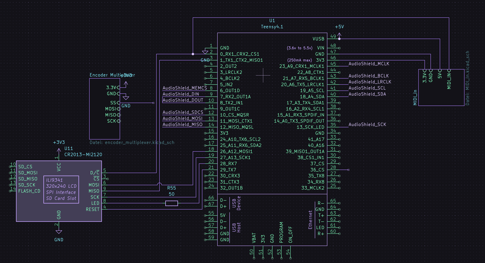
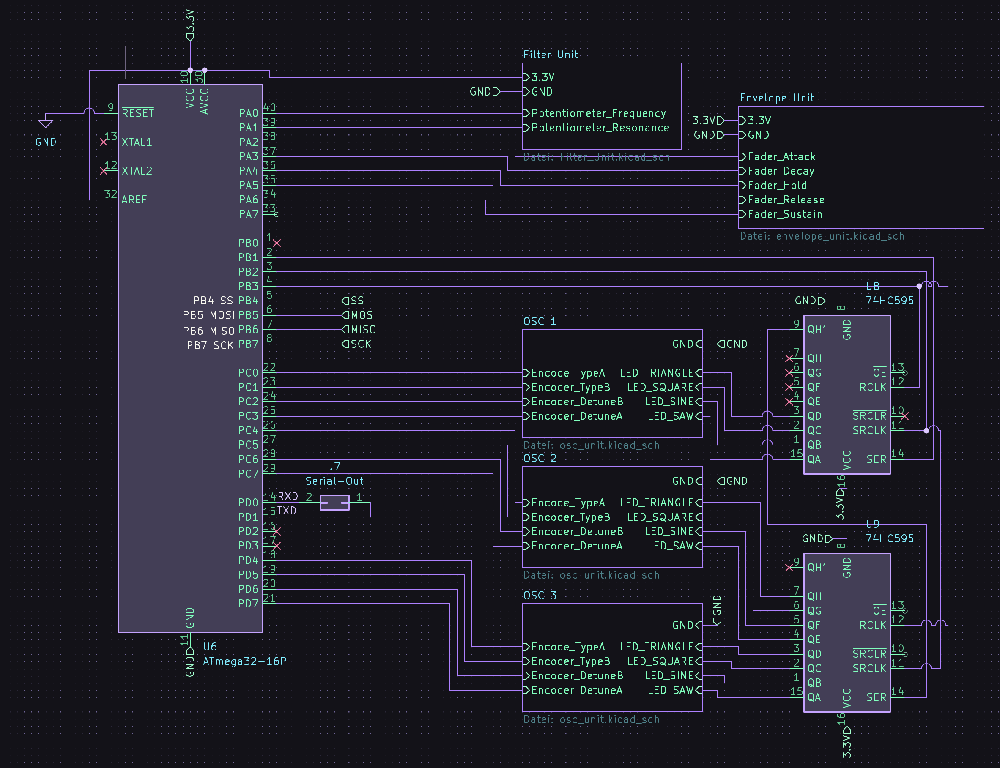
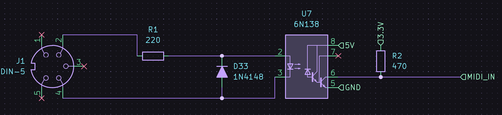
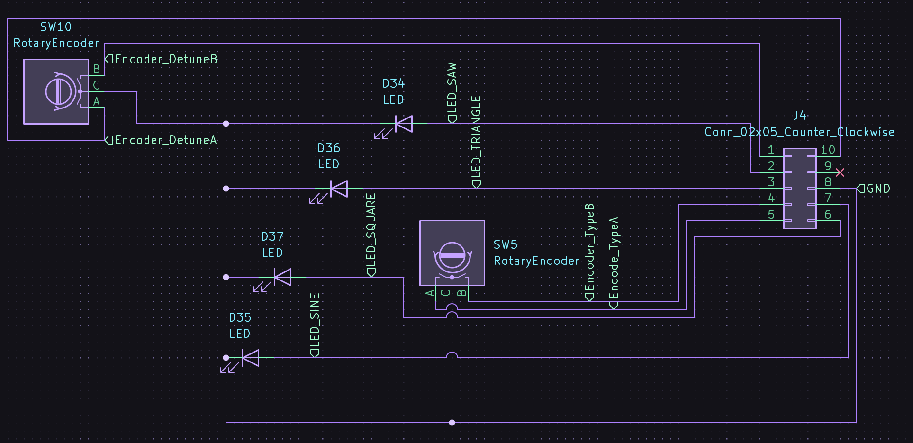
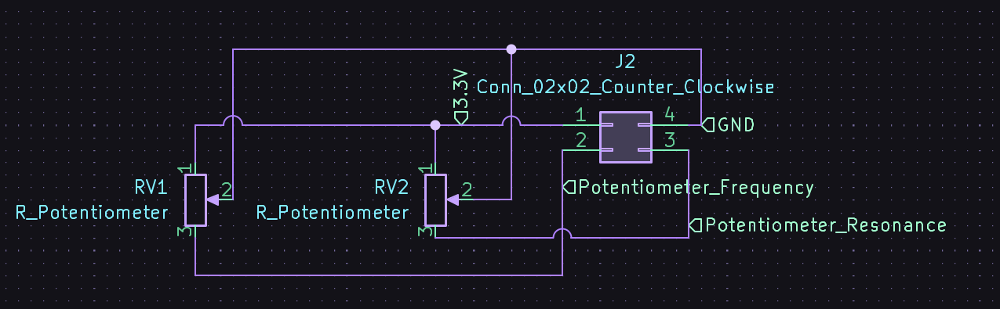

#+TODO: TODO WIP VERIFY | DONE CANCELED

* Polyhymnia - Hybrid Synthesizer
Polyhymnia is an experimental hybrid-synthesizer. It is planned to use an Teensy 4.1 as oscillators and envelope-generator but using analogue filters.

Since I'll try to develop it myself version 1 will be completely digital, adding the analogue stuff incrementally as the project evolves.

!!!!! NOTE !!!!!
Everything here is currenty under heavy development, so use at your own risk. Every code and schematics could and will change over time without warning ;)

* Used MIDI-CC
| CC value | Waveform |
|----------+----------|
|        0 | Sawtooth |
|        1 | Triangle |
|        2 | Square   |
|        3 | Sine     |

| CC value | Filter Type |
|----------+-------------|
|        0 | Low Pass    |
|        1 | High Pass   |
|        2 | Band Pass   |

| CC# | Function     |
|-----+--------------|
|  70 | VCO1 Type    |
|  76 | VCO1 Detune  |
|  77 | VCO2 Type    |
|  78 | VCO2 Detune  |
|  85 | VCO3 Type    |
|  86 | VCO3 Detune  |
|-----+--------------|
|  73 | Attack       |
|  80 | Decay        |
|  75 | Sustain      |
|  72 | Release      |
|-----+--------------|
|  74 | Cutoff       |
|  71 | Resonance    |
|  89 | Filtertype   |
|-----+--------------|
| 105 | LFO Rate     |
| 106 | LFO Amount   |
|-----+--------------|
| 20  | VCO1 Volume  |
| 21  | VCO2 Volume  |
| 22  | VCO3 Volume  |
| 23  | Noise Volume |
| 24  | Total Volume |

* Vision
- digitally created oscillators using the Teensy 4.1
- using hardware parts for quick access for the most needed settings, like OSC-tuning, ADSR etc.
- TFT/LCD-Display for saving/loading patches
- full MIDI-IO
- saveable patches
- 4x8 LED-Strip to show custom graphics, waveforms or whatever
- motorized fader for ADSR, so they "drive in place" if a saved patch gets loaded
- effect-section (delay, reverb, ...)
- totally standalone, but with MIDI-controllability (USB or DIN)
- onboard speaker as "emergency output" (quality will be shit, but nice enough to fiddle at patches, I guess)
- Case: Case for holding the synth with a little place for placing an MPK mini Plus as keys (could get connected via MIDI-cable then)

* Milestones
** WIP Software [0/3]
  - [-] Display control library
    - WIP Get connection working (reading ID and/or reset the screen)
  - [-] SPI communication
  - [ ] Design UI
  - Features [0/4]
    - [ ] Add code for LFO
    - [-] Saving/Loading settings to/from SD-card
    - [-] Saving/Loading patches to/from SD-card
    - [ ] Add effects (Reverb, Delay, BitCrush, ...)
** WIP Hardware [1/3]
  - [X] Build MIDI-port
  - [-] Display control
    - [-] Find working pinout/connection 
  - [-] Build Oscillator control modules [1/6]
    - [X] OSC 1
    - [ ] OSC 2
    - [ ] OSC 3
    - [ ] Build Status-LED-Driver module
    - [ ] Build Envelope control module
    - [ ] Build Filter control module

** TODO Enclosure [0/2]
    - [ ] Design Enclosure
    - [ ] Build Enclosure

** TODO Documentation [0/1]
    - [ ] Update parts list

* Plan for Version 0.1 [1/5]
- [X] playable (controlled via Pure Data "software-UI" with pass-thru MIDI-Controller-Keyboard) via USB-Midi
- [ ] 3 detunable VCOs with selectable waveforms (Saw, Triangle, Sine, Square)
- [ ] controllable ladder-Lopass-filter
- [ ] controllable LFO for automating filter
- [ ] controllable ADSR-Envelope
  
* Ideas for later
- Onboard-Sequencer
- Oscilloscope for showing the generated wave-form

* Parts list [12/16]
- [X] Teensy 4.1
- [X] Teensy Audio Shield
- [X] 2x Buchsenleisten 1x24
- [X] 10x Rotary Encoder (ALPS?)
- [X] 4x8 LEDs (rot)
- [X] 4x Linear-Potentiometer (motorised?)
- [ ] 4x 74HC595 Shift-Registers
- [ ] 1x momentary switch (closed)
- [X] 2x Optokoppler 6N138
- [X] 2x DIN-Buchse 5-polig
- [ ] 1x CR2032 Halter
- [ ] 1x Audiobuchse 6.5mm
- [X] 1x ILI9341 Color TFT
- [X] 220 Ohm Resistor
- [X] 470 Ohm Resistor
- [X] 12 Red LED

* Schematics

[[./Schematics/img/Envelope_Unit.png][Envelope Control Unit Schematics]]
[[./Schematics/img/Envelope_Unit.png]]
